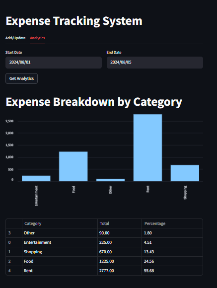

# 💰 Expense Tracking System

A full-stack application for tracking personal expenses with a clean interface, category-based analytics, and persistent storage.

---

## 🔧 Tech Stack

- 🎯 **Backend**: FastAPI (Python)
- 📊 **Frontend**: Streamlit
- 🗄️ **Database**: MySQL
- 🛠️ **Other**: Logging, Modular Structure

---

## 📁 Project Structure

Project_expense_tracking_system/
├── backend/ # FastAPI server logic & database interaction
│ ├── server.py
│ ├── db_helper.py
│ └── logging_setup.py
├── database/
│ └── expense_db_creation.sql # MySQL schema
├── frontend/
│ └── app.py # Streamlit interface
├── requirements.txt
└── README.md


---

## ✨ Features

### 🧾 Add/Update Tab
- Add new expense entries with:
  - 📅 Date
  - 💸 Amount
  - 🏷️ Category
  - 📝 Notes
- Edit existing entries
- Store data in MySQL

### 📈 Analytics Tab
- Select **Start Date** and **End Date**
- Visualize:
  - Total spending by category
  - Interactive bar chart with Streamlit

---

## ⚙️ Setup Instructions

### ✅ Requirements
- Python 3.8+
- MySQL Server

### 🧪 Installation

1. **Clone the repository**
   ```bash
   git clone https://github.com/yourusername/expense-management-system.git
   cd Project_Expense_Tracking_System

2. **Install Dependencies**
    ```bash
    pip install -r requirements.txt

3. **Set up MySQL database**
    ```bash
   -- In MySQL:
    CREATE DATABASE expense_db;
    USE expense_db;
    
    -- Run the SQL file:
    source database/expense_db_creation.sql;

4. **Run FastAPI backend**
    ```bash
   uvicorn backend.server:app --reload

5. **Launch Streamlit frontend**
    ```bash
    streamlit run frontend/app.py
   
📸 Screenshots

Add/update tab


Analytics tab



🧪 Tests

Test cases are located in the tests/ folder.

🏗️ Future Work
- User login system
- Monthly budget goals
- Export data (CSV/PDF)
- Pie chart visualizations


👩‍💻 Author

Divyanshi Chaurasia

🔗 www.linkedin.com/in/divyanshi-chaurasia
📫 dchaurasia.1011@gmail.com
